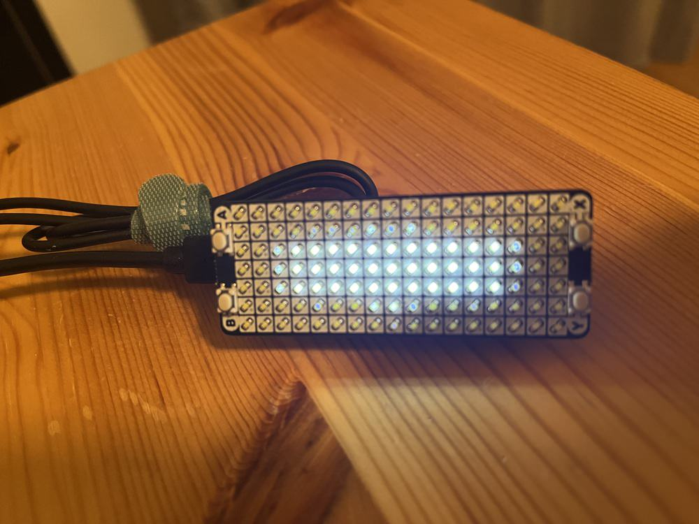

# Blinker

A few weeks ago I read [a HackerNews comment](https://news.ycombinator.com/item?id=38276107) that mentioned that a blinking light that went from a fast heartbeat to a slow heartbeat around their field of vision would help her/him focus on just work.

I had a spare Pico W to try, but the blinking LED built in the board is too dim, so I ordered a [PicoScroll](https://shop.pimoroni.com/products/pico-scroll-pack) from Pimoroni and wrote this. Worth trying, or at least having fun tinkering.

The PicoScroll is an array of 17x7 LEDs with 4 tactile buttons, very convenient for this project.

---

## Usage

After loading the code in your Pico, just power it in and it will start beating. The beating shape is something close to a tapered oval in the middle of the LED matrix. The initial settings are:

- High BPM: 150
- Low BPM: 54
- Initial brightness: 40
- Initial blinking time: 25 minutes (`total time`/3 going from 150 to 54 and the remaining at 54)

The first two are constants in the code, feel free to change them. The rest can be controlled with the buttons.

- Pressing `X`: will stop the beating or alternatively (if in another "mode") turn off the LEDs.
- Pressing `A`: will start/restart the beating, with the current settings.
- Pressing `B`: will cycle LED brightness from current brightness up to 100, and then roll from 20 up. So brightness is 20-100. I have found 50 ideal, and anything higher than 100 too bright. This works while it is running, if it is stopped by pressing `X` you will see the current brightness on the LED matrix too.
- Pressing `Y` (only after having stopped it with `X`) will let you change the blinking time in steps of 5 minutes up to 60 minutes.

When the current period has finished it will beat brighter to make you realize it has finished and then stop. Pressing `A` restarts it with the same settings.

## Misc

I was a bit lazy to add tests, but at least I refactored from the initial version where everything was scattered in the file and relying on `global`. Not that different from a huge class handling the state machine, but at least now it _could_ be tested.

Potentially, I could take advantage of modes and buttons to let the beats be configurable. But I haven't found that interesting or useful.